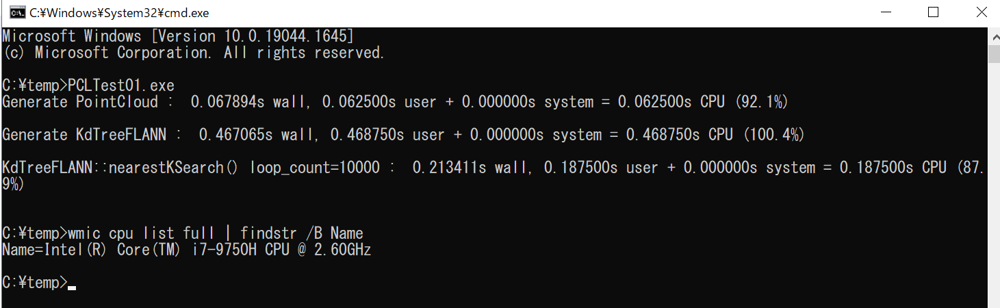

# PCLTest01
[PCL](https://pointclouds.org/)のKdTreeFLANN::nearestKSearch()のベンチマークテスト。

100万点のPointCloudを用意して、指定した地点から近い順に100個の点を抽出するのにどのぐらい時間がかかるかを調べる。

#### 実行結果

  * 

#### メモ
  - KdTreeを作る処理は0.5秒ぐらい
  - KdTreeFLANN::nearestKSearch()を1万回繰り返してトータル0.2秒ぐらい
      - 1回のKdTreeFLANN::nearestKSearch()の呼び出しは、1ミリ秒もかかっていない感じ？

#### ソースコード

```
#include <pcl/point_cloud.h>
#include <pcl/kdtree/kdtree_flann.h>

#include <iostream>
#include <vector>
#include <ctime>
#include <cmath>
#include <boost/timer/timer.hpp>

int main(int argc, char ** argv[])
{
    boost::timer::cpu_timer timer1;

    timer1.start();
    pcl::PointCloud<pcl::PointXYZ>::Ptr cloud(new pcl::PointCloud<pcl::PointXYZ>);

    // (1) PointCloudを生成する
    cloud->width = 1000000;
    cloud->height = 1;
    cloud->points.resize(cloud->width * cloud->height);

    srand(time(NULL));

    for (std::size_t i = 0; i < cloud->size(); ++i)
    {
        (*cloud)[i].x = 1024.0f * rand() / (RAND_MAX + 1.0f);
        (*cloud)[i].y = 1024.0f * rand() / (RAND_MAX + 1.0f);
        (*cloud)[i].z = 1024.0f * rand() / (RAND_MAX + 1.0f);
    }
    timer1.stop();

    std::cout << "Generate PointCloud : " << timer1.format() << std::endl;

    // (2) PointCloudからKdTreeFLANNを作る
    boost::timer::cpu_timer timer2;
    timer2.start();
    pcl::KdTreeFLANN<pcl::PointXYZ> kdtree;
    kdtree.setInputCloud(cloud);
    timer2.stop();

    std::cout << "Generate KdTreeFLANN : " << timer2.format() << std::endl;

    // (3) KdTreeFLANN::nearestKSearch()を使用して、指定した点から近い順にK個の点を取得する
    const int loop_count = 10000;
    const int K = 100;

    boost::timer::cpu_timer timer3;
    timer3.start();

    for (int i = 0; i < loop_count; ++i)
    {
        std::vector<int> pointIdxKNNSearch(K);
        std::vector<float> pointKNNSquaredDistance(K);

        pcl::PointXYZ searchPoint;

        searchPoint.x = 1024.0f * rand() / (RAND_MAX + 1.0f);
        searchPoint.y = 1024.0f * rand() / (RAND_MAX + 1.0f);
        searchPoint.z = 1024.0f * rand() / (RAND_MAX + 1.0f);

        kdtree.nearestKSearch(searchPoint, K, pointIdxKNNSearch, pointKNNSquaredDistance);
    }

    timer3.stop();

    std::cout << "KdTreeFLANN::nearestKSearch() loop_count=" << loop_count <<  " : " << timer3.format() << std::endl;

    return 0;
}
```
